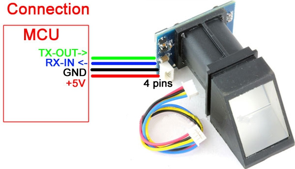

Introduction
============

R305
----
R305 is a Fingerprint Identification Module of R30X series.
This module operated on UART thus can be used with microcontrolers,
Raspberry Pi and also with any computer (using USB to UART convertor).

Hardware Specifications
-----------------------

======================  ================================  ===================  ================================
Power                   DC 3.6V-6.0V                      Interface            UART(TTL logical level)/ USB 1.1
Working current         Typical: 100mA Peak: 150mA        Matching Mode        1:1 and 1:N
Baud rate               (9600*N)bps,N=1~12 (default N=6   Character file size  256 bytes
Image acquiring time    <0.5s                             Template size        512 bytes
Storage capacity        256                               Security level       5 (1, 2, 3, 4, 5(highest))
FAR                     <0.001%                           FRR                  <0.1%
Average searching time  < 1s (1:1000)                     Window dimension     18mm*22mm
Working environment     Temp: -10°C- +40°C / RH: 40%-85%  Storage environment  Temp:-40°C- + / RH: <85%
======================  ================================  ===================  ================================

Hardware Interface
------------------

====  ====  ======================================================
Name  Type  Function Description
====  ====  ======================================================
+5V   in    Power input
GND   -     Signal ground. Connected to power ground (color: black
Tx    in    Data Output. TTL logic level
Rx    out   Data input. TTL logic level
====  ====  ======================================================

Communication Protocol
----------------------

Data package format
~~~~~~~~~~~~~~~~~~~

When  communicating,  the  transferring  and  rece
iving  of  command/data/result  are  all  wrapped  in  
data package format.

======  ====  ==========  =======  ===============  ========
Header  Addr  Package     Package  Package Content  Checksum
              Identifire  Length
======  ====  ==========  =======  ===============  ========
